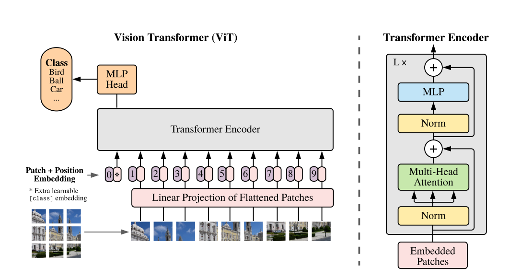

This notebook demonstrates the implementation of a Vision Transformer (ViT) from scratch using PyTorch. The Vision Transformer is a model for image classification that leverages the Transformer architecture, which has been highly successful in natural language processing tasks.

For more details, refer to the [Vision Transformer paper](https://arxiv.org/abs/2010.11929).

## Table of Contents
- [Table of Contents](#table-of-contents)
- [Imports and Dataset Preparation](#imports-and-dataset-preparation)
- [Model Components](#model-components)
  - [Patcher](#patcher)
  - [LinearProjectionFlatten](#linearprojectionflatten)
  - [PositionalEncoder](#positionalencoder)
  - [SelfAttention](#selfattention)
  - [AttentionBlock](#attentionblock)
  - [TransformerEncoder](#transformerencoder)
  - [MLPHead](#mlphead)
  - [VisionTransformer](#visiontransformer)
- [Training the Model](#training-the-model)
- [Results](#results)

## Imports and Dataset Preparation

The notebook starts by importing necessary libraries and preparing the CIFAR-10 dataset. The dataset is transformed into tensors and labels are one-hot encoded.

## Model Components

### Patcher

The `Patcher` class is responsible for dividing the input image into smaller patches. Each patch is then flattened into a vector.

### LinearProjectionFlatten

The `LinearProjectionFlatten` class takes the patches created by the `Patcher` and projects them into a higher-dimensional space using a linear layer.

### CLSAdder

The `CLSAdder` class is responsible for:

1. **Adding a `[CLS]` token** to the beginning of the sequence of patch embeddings.
2. **Adding positional embeddings** to retain spatial information.

### SelfAttention

The `SelfAttention` class implements the self-attention mechanism, which allows the model to focus on different parts of the input sequence.

### AttentionBlock

The `AttentionBlock` class combines the self-attention mechanism with linear projections to form a complete attention block.

### TransformerEncoder

The `TransformerEncoder` class stacks multiple attention blocks and adds normalization and feed-forward layers.

### MLPHead

The `MLPHead` class is a simple feed-forward network that produces the final classification logits.

### VisionTransformer

The `VisionTransformer` class combines all the components to form the complete Vision Transformer model.

## Training the Model

The model is trained on the CIFAR-10 dataset for 10 epochs using the Adam optimizer and cross-entropy loss.

## Results

The training loss is plotted to visualize the training process.