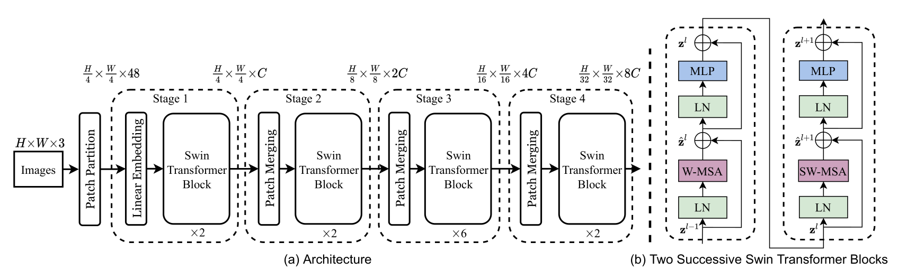

# Swin Transformer Implementation Using PyTorch

This notebook demonstrates the implementation of a Swin Transformer from scratch using PyTorch. The Swin Transformer (Shifted Window Transformer) is a hierarchical vision model that improves computational efficiency by computing self-attention within local windows and introducing shifted windows to capture cross-window connections.

For more details, refer to the [Swin Transformer paper](https://arxiv.org/abs/2103.14030).

## Table of Contents
- [Table of Contents](#table-of-contents)
- [Imports and Dataset Preparation](#imports-and-dataset-preparation)
- [Model Components](#model-components)
  - [PatchPartition](#patchpartition)
  - [LinearEmbedding](#linearembedding)
  - [WindowAttention](#windowattention)
  - [SwinTransformerBlock](#swintransformerblock)
  - [PatchMerging](#patchmerging)
  - [SwinTransformer](#swintransformer)
- [Training the Model](#training-the-model)

## Imports and Dataset Preparation

The notebook starts by importing the necessary libraries and loading a downscaled dataset (e.g., MNIST or CIFAR resized to 32×32). Each grayscale image is divided into patches and normalized before being fed to the Swin Transformer model.

## Model Components

### PatchPartition

The `PatchPartition` class splits the input image into non-overlapping patches of size `(patch_size × patch_size)`, then flattens and reshapes the result into shape `(B, H//p, W//p, patch_dim)`, where `patch_dim = patch_size² × channels`.

### LinearEmbedding

The `LinearEmbedding` class projects the flattened patch features into a higher-dimensional embedding space (e.g., 32 or 96) using a linear layer. This is analogous to word embedding in NLP transformers.

### WindowAttention

The `WindowAttention` class computes **self-attention** within each non-overlapping window of size `(window_size × window_size)` independently. This reduces complexity from quadratic in the full image size to quadratic in the window size.

### SwinTransformerBlock

The `SwinTransformerBlock` is the main processing unit. It contains two stages:
- **W-MSA** (Window-based Multi-head Self-Attention)
- **SW-MSA** (Shifted Window Multi-head Self-Attention)

Shifted windows allow information to flow between windows, maintaining global coherence.

### PatchMerging

The `PatchMerging` class is used for **downsampling**. It concatenates neighboring patches (e.g., a 2×2 grid), applies a linear layer, and reduces the spatial resolution by 2 while increasing the feature dimension.

### SwinTransformer

The `SwinTransformer` class combines:
- Patch Partition
- Embedding
- Two Stages:
  - Stage 1: W-MSA + SW-MSA + Patch Merging
  - Stage 2: W-MSA + SW-MSA
- Global pooling + classification head

Each stage doubles the feature dimension and halves the resolution.

## Training the Model

The model is trained using the Adam optimizer and cross-entropy loss. The training loop includes:
- Forward pass
- Loss computation
- Backward pass
- Optimizer step
- Evaluation using test accuracy

A simple learning rate scheduler (e.g., StepLR) is used to adjust learning rate over epochs.